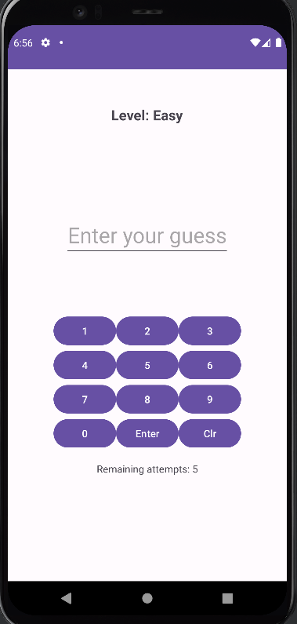

# Guess The Number

Guess The Number is a simple Android application where players try to guess a randomly generated number within a limited number of attempts.

## Overview

Guess The Number offers three levels of difficulty: Easy, Medium, and Hard. Players can select their preferred level before starting the game. The game provides feedback after each guess, informing the player whether their guess was too high or too low. The player has a limited number of attempts to guess the correct number, depending on the selected difficulty level.

## Features

- Three levels of difficulty: Easy, Medium, and Hard.
- Feedback on each guess: Too high, Too low, or Correct guess.
- Limited number of attempts based on the selected difficulty level.
- Option to start a new game at any time.

## Screenshots

## Getting Started

To run the application locally, follow these steps:

1. Clone this repository: `git clone https://github.com/Atharav31/Number-Guessing-game.git`
2. Open the project in Android Studio.
3. Build and run the application on an emulator or physical device.

## Contributing

Contributions are welcome! If you'd like to contribute to Guess The Number, feel free to fork this repository and submit a pull request with your changes.

